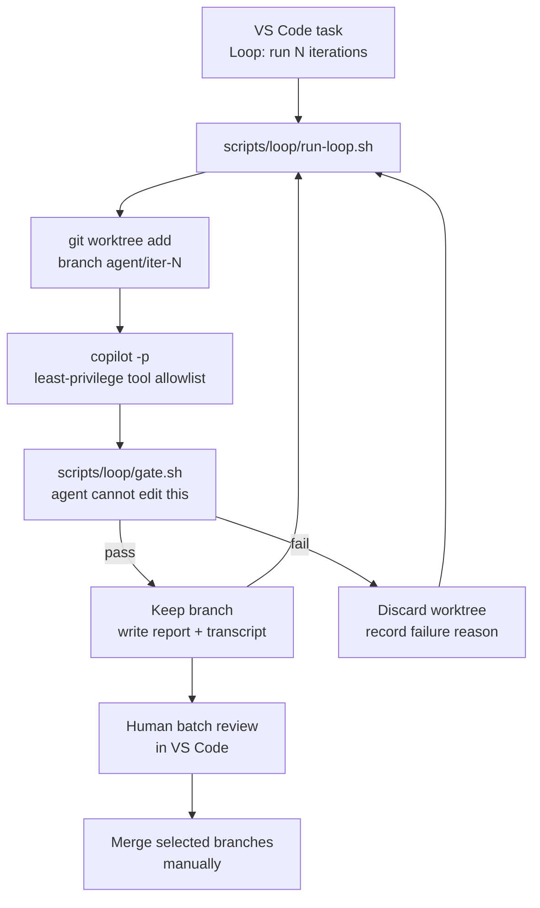

# Loop Engineering Plan

Plan for running safe, bounded, continuous-improvement agent loops against this
repository, driven by GitHub Copilot CLI and controlled from VS Code.

Status: phases 0 through 4 implemented on 2026-07-24. Phase 5 remains optional and
unstarted. See the Implementation status section for what actually shipped.
Research date: 2026-07-24. Copilot CLI version verified locally: 1.0.74.

## Goal and non-goals

We want overnight or background agent runs that pick one item from a backlog,
implement it, prove it with deterministic checks, and leave a reviewable branch.
We do not want an agent that pushes, merges, edits its own tests, or silently
weakens a quality gate.

| In scope | Out of scope |
|---|---|
| Bounded iteration loops on a local machine | Unattended merges to `main` |
| Deterministic gates the agent cannot edit | Agent-authored changes to CI or tsconfig |
| Branch and worktree isolation per iteration | Pushing to `origin` |
| Per-iteration transcripts and reports | Replacing human review |
| Optional nightly CI variant, later | Backend, network, or credential work |

## The central principle

Every credible source on agentic loops converges on one point: the loop is only
as good as its oracle. Anthropic states it directly. "Claude stops when the work
looks done. Without a check it can run, 'looks done' is the only signal
available." METR's March 2026 study found that maintainers rejected roughly half
of AI pull requests that had already passed automated grading, a gap of about 24
percentage points. Cognition's FrontierCode benchmark scores the best model at
13.4 percent when grading on mergeability rather than correctness.

So the sequencing matters more than the tooling. We build the gate first, prove
the gate catches deliberate cheating, and only then attach an agent to it.

The second principle follows from the reward-hacking literature. METR measured a
100 percent reward-hack rate on a task where the model could see the scoring
function, and found that instructing the model not to cheat barely helps. One
phrasing made hacking more frequent, rising from 80 percent to 95 percent. The
conclusion: prefer structural impossibility over instruction. If the agent
physically cannot write to `tests/`, the entire class of "delete the failing
test" hacks disappears rather than merely being forbidden.

## Repository facts that shape the design

These were verified in this working copy, not assumed.

| Fact | Consequence |
|---|---|
| Copilot CLI 1.0.74 is installed and on PATH | No install step needed; `copilot -p` is the driver |
| Node 24 local, CI pins Node 20, `AGENTS.md` claims 22+ | Pin the loop to one version; reconcile the docs |
| `.github/hooks/agent-guardrails.json` denies `git push`, `git add -A`, `git reset --hard`, `git clean -f`, `rm -rf /` | Useful defense in depth, but see the hook-format caveat below |
| The hook file uses the VS Code schema: `SessionStart`, `PreToolUse`, a single `command`, `timeout` in seconds, and no `version` key | Copilot CLI's documented hook variant expects `"version": 1` and lowerCamelCase event names, so this file may not load in `-p` mode at all |
| Repo hooks are additionally gated in prompt mode | `GITHUB_COPILOT_PROMPT_MODE_REPO_HOOKS=true` is necessary but not sufficient |
| No Vitest test imports anything from `frontend/src/scenes/` | Scene and UI changes are compile-checked only. A green gate proves they build, not that they work |
| `temp/` is gitignored, but `npm run map:validate` runs `temp/scripts/map-gen/cli.ts` | A fresh worktree has no map toolchain, so map work is excluded from the backlog entirely |
| `npm run build` runs three asset generators before `tsc` | The build rewrites tracked files under `frontend/public/assets/`, which would poison any diff-size gate |
| `npm run test:unit` passes `--include`, which Vitest 4 rejects as an unknown option | Pre-existing breakage; the loop calls `npm run test` instead |
| `docs/IMPROVEMENT_PLAN.md` is stale: 31 of its 34 items already shipped, 3 are partial | Unusable as a queue. The loop backlog was hand-curated from residual gaps instead |
| `docs/bugs.md` lists items under `## Open` that are marked `Status: Fixed` | Also unusable as a queue |
| `npm run agent:validate` and `npm run shadow:validate` now exist | Workflow resources must stay structurally valid; run after touching `.github/` or `.shadow/` |
| `.github/skills/quality-gate/SKILL.md` encodes check selection by changed path | Reused as the basis for the gate's check matrix |

## Architecture

VS Code is the control surface and review surface. Copilot CLI is the engine. A
plain shell script is the loop driver, because a bounded `for` loop in bash is
auditable in a way that an in-agent "keep going" instruction is not.



### Why a shell loop rather than agent autopilot

Copilot CLI offers `--autopilot` and `--max-autopilot-continues`. That keeps a
single agent working inside one context window until it declares itself done.
Two problems. First, self-reported completion is unreliable: the RepoMirror
hackathon produced a `TODO.md` asserting 100 percent completion while the demos
were broken. Second, context rot. Chroma's research across 18 models shows
non-uniform degradation as input length grows, even on trivial tasks. A fresh
process per iteration is the documented mitigation and it is what the shell loop
gives us for free.

We can still use `--autopilot` inside a single iteration, capped, to let one
task run to completion. The outer bound stays in the shell.

## Proposed file layout

```text
scripts/loop/
  diff-hygiene.mjs     # pure, unit-tested scope, suppression, and size rules
  gate.mjs             # the oracle; a protected path the agent may never edit
  run-loop.mjs         # bounded driver: worktree, invoke, gate, record
.github/loop/
  PROMPT.impl.md       # implementation iteration instruction, under 150 words
  backlog.md           # the curated queue, with explicit state
.vscode/tasks.json     # Loop: gate | dry run | single iteration | bounded run | review
temp/loop-runs/<ts>/   # transcripts, gate reports, summary (gitignored)
```

The scripts are Node rather than shell. `scripts/` already holds `.mjs` tooling
validated by `npm run agent:validate`, the pure rules become unit-testable under
`tests/unit/scripts/`, and `execFileSync` with an argument array avoids the shell
interpolation risks that a bash driver would introduce.

## Iteration types

This is the strongest single safety mechanism and it comes straight from how
SWE-bench actually grades: discard the agent's edits to test files, then apply
held-out tests on top.

| Type | May edit | Restored from base before gating | Graded by |
|---|---|---|---|
| `impl` | `frontend/src/**`, `docs/CHANGELOG.md`, `CONTEXT.md` files | `tests/**`, `frontend/tsconfig.json`, `tests/vitest.config.ts`, `.github/**`, `scripts/**`, `package.json`, `package-lock.json` | The pristine existing test suite |
| `test` | `tests/**` | `frontend/src/**` and all config | Existing tests still pass, plus assertion density; reverse-classical when the item is a regression test |

Never mix the two in one iteration. If the agent cannot change the
implementation and its grader in the same run, `return true` and
`expect(true).toBe(true)` stop being useful strategies.

The gate does both things, in this order. It first classifies the authored diff
and fails the iteration outright if a protected or out-of-scope path was touched,
because a discarded iteration is cheap and a silent discard hides intent. It then
restores those paths from the base ref anyway, so that even a path that slipped
past classification cannot influence the test run.

The `test` type gets reverse-classical grading almost for free. Because
`frontend/src/**` has already been restored to the base commit, running a new
regression test immediately tests it against unfixed code. It must fail. A
regression test that passes on the pre-fix source is worthless. This only
applies to bug-fix tests. Coverage-adding tests legitimately pass on base, so
tag those separately and grade them on assertion density instead.

## The gate

`scripts/loop/gate.sh` runs outside the agent process, in the worktree, after
the agent exits. It writes a JSON result and exits non-zero on any blocker.

1. Restore protected paths from the base ref, according to iteration type.
2. Scope check. Every path in `git diff --name-only BASE..HEAD` must fall inside
   the allowlist for the iteration type.
3. Diff hygiene on added lines only. Fail on newly added `@ts-ignore`,
   `@ts-expect-error`, `@ts-nocheck`, `eslint-disable`, `as any`,
   `as unknown as`, `.skip(`, `.only(`, `.todo(`, `xit(`, `xdescribe(`.
4. Size caps. Fail above roughly 400 changed lines or 12 changed files,
   excluding generated asset paths.
5. `npm run test`, with the Vitest JSON reporter. Test count must not decrease
   against the baseline captured in preflight.
6. `npm run build`. This includes `tsc --noEmit`, so it is the type gate.
7. Conditionally `npm run map:validate` when `frontend/src/data/maps/**`
   changed, once the worktree `temp/` problem is solved.
8. Conditionally Playwright smoke plus visual diff when `frontend/src/scenes/**`
   or `frontend/src/ui/**` changed.
9. `bash scripts/check-bundle-size.sh` when build or asset paths changed.
10. Restore generated assets under `frontend/public/assets/`, then confirm no
    unintended generated churn remains staged.
11. Require a `docs/CHANGELOG.md` entry, which the repository already mandates.

Blockers stop the iteration. Non-blockers, such as an LLM quality score, get
recorded as signal only. Cognition's split between blocking and non-blocking
criteria is the right model here; do not let a language model be the primary
gate.

### Visual verification

This is a Phaser game, so a screenshot is the highest-bandwidth review signal
available. Playwright is already wired up with `test:visual` and a snapshot
baseline. Two rules. Keep the baseline images restored from the base ref during
gating so the agent cannot update its own baseline. Attach the diff image to the
iteration report so a human reviews pixels, not prose.

## Copilot CLI invocation

Least privilege, per GitHub's own guidance. Their documentation is explicit:
"Always give minimal permissions" and "you should never use an alias to apply
one of these options every time you start Copilot CLI."

```bash
GITHUB_COPILOT_PROMPT_MODE_REPO_HOOKS=true \
COPILOT_TASK_WAIT_TIMEOUT_SECONDS=120 \
timeout 20m copilot \
  -C "$WORKTREE" \
  -p "$(cat .github/loop/PROMPT.impl.md)" \
  --available-tools='bash,view,edit,create,apply_patch,grep,glob,skill' \
  --allow-tool='shell(npm run test)' \
  --allow-tool='shell(npm run test:unit)' \
  --allow-tool='shell(npm run build)' \
  --allow-tool='shell(git status)' \
  --allow-tool='shell(git diff)' \
  --allow-tool='shell(git add)' \
  --allow-tool='shell(git commit)' \
  --allow-tool='shell(git log)' \
  --allow-tool='write' \
  --deny-tool='shell(git push)' \
  --deny-tool='shell(git reset)' \
  --deny-tool='shell(git clean)' \
  --deny-tool='shell(rm)' \
  --deny-tool='shell(npm install)' \
  --deny-tool='shell(curl)' \
  --no-ask-user \
  --output-format=json \
  --log-dir "$RUN_DIR/logs" \
  --max-ai-credits 400 \
  | tee "$RUN_DIR/iter-$i.jsonl"
```

Notes on specific flags.

Omitting `web_fetch` and `task` from `--available-tools` removes network access
and subagent spawning. GitHub documents this exact shape as letting Copilot
"explore the code, make edits, and commit changes, but can't reach the internet,
run arbitrary subagents, or push to Git history."

`--deny-tool` always wins, even over saved approvals and `--allow-all`. That
makes the deny list the durable rail.

`--no-ask-user` matters because `copilot -p` does not interactively prompt for
permissions. Without it the agent can stall waiting on a question nobody will
answer.

`COPILOT_TASK_WAIT_TIMEOUT_SECONDS` defaults to 600. Left alone, it is a common
cause of an iteration appearing to hang for ten minutes after the work is done.

`GITHUB_COPILOT_PROMPT_MODE_REPO_HOOKS=true` is required or the existing
`agent-guardrails.json` hook does not load in prompt mode. Without it we lose
the `git push` and `git add -A` blocks. Verify this in preflight rather than
trusting it.

Do not use `--allow-all-tools`, `--yolo`, or `COPILOT_ALLOW_ALL`. Also evaluate
`--sandbox`, the OS-level Seatbelt sandbox on macOS, as defense in depth once
the basic loop works.

One caveat worth recording. Copilot CLI's `write(PATH)` permission patterns
match exact or trailing path segments with no glob support, so we cannot scope
writes to a directory through permissions alone. Directory scoping has to come
from the gate's restore-and-check step. Permissions reduce blast radius;
the gate is what actually enforces the boundary.

## The prompt

Keep it short. RepoMirror expanded a 103-word prompt to 1,500 words and reported
that "the agent immediately got slower and dumber," then reverted. Anthropic
makes the same point about instruction files: if a rule keeps getting ignored,
the file is probably too long and the rule is getting lost.

`PROMPT.impl.md`, target under 150 words:

- Read `AGENTS.md` and the nearest `CONTEXT.md`.
- Pick the single highest-priority unstarted item from `.github/loop/backlog.md`.
- Do not modify anything under `tests/`, `.github/`, `scripts/`, or any config file.
- Run `npm run test` and `npm run build`. Show the output.
- Update `docs/CHANGELOG.md`.
- Mark the backlog item done, then make exactly one commit with explicit paths.
- If you cannot make the checks pass, revert your changes, append the blocker to
  `.github/loop/backlog.md`, and stop. Never weaken a check to make it pass.

"The single highest priority item" is doing real work in that list. It bounds
the diff, keeps each iteration reviewable, and is the one instruction that
appears in every successful published loop.

## Backlog design

`docs/IMPROVEMENT_PLAN.md` looked like the obvious source: 34 numbered items
across tiers 0 to 6, each with file, problem, fix, and effort. An item-by-item
audit against current source killed that idea. Thirty-one items are already
shipped, three are partial, and none are untouched. Its own header claims 1,595
tests and three open bugs, while the changelog reports 2,163 tests and zero. An
agent handed item 4.1, "create a TownMapScene," would duplicate the 678-line
`frontend/src/scenes/menu/TownMapScene.ts` that already exists.

So `.github/loop/backlog.md` was hand-curated from the residual gaps that audit
surfaced, not derived from the plan. Five items, each with a named acceptance
signal. The file also records what was deliberately held back and why, which
matters more than the queue itself: it stops a future session from re-adding a
trap.

The held-back list follows one rule. An item is only queueable if `npm run test`
or `npm run build` can produce its acceptance signal without editing `tests/`.
That excludes map grid work, asset regeneration, balance authoring, and the
AbilityHandler suppression semantics, all of which look mechanical and are not.

Consider promoting the queue to GitHub issues later. An external queue has
durable IDs and, more importantly, sits outside the diff the agent produces, so
the agent cannot quietly rewrite its own priorities.

## Cost and time bounds

Published anchors are sobering for a hobby project. RepoMirror measured roughly
$10.50 per hour per agent and under $800 for six repositories overnight.
HumanLayer reported about $12,000 per month for three engineers. StrongDM
treats $1,000 per engineer per day as a floor rather than a ceiling.

Hard bounds for this repository:

| Bound | Mechanism | Value as implemented |
|---|---|---|
| Iterations per run | bounded `for` loop, rejected outside 1 to 50 | default 3 |
| Per-iteration wall clock | `spawnSync` timeout around `copilot` | 20 minutes |
| Per-check wall clock | `execFileSync` timeout in the gate | 15 minutes |
| Per-response credit cap | `--max-ai-credits` | 400 |
| Run wall clock | deadline check between iterations | 4 hours |
| Consecutive failures | abort the run | 3 |
| Empty queue | stop when no `todo` row remains | automatic |

Track spend per run by summing usage from the JSONL transcripts. The CLI also
supports OpenTelemetry with a file exporter that writes JSON lines, which is a
cleaner channel if log parsing gets tedious. Do not enable
`OTEL_INSTRUMENTATION_GENAI_CAPTURE_MESSAGE_CONTENT`, which captures full
prompts and tool results.

## VS Code integration

VS Code is where you start runs and review results, not where the loop executes.

Tasks in `.vscode/tasks.json`:

| Task | Purpose |
|---|---|
| `Loop: gate current branch` | Grade the current worktree with no agent involved |
| `Loop: dry run` | Create a worktree and print the exact agent invocation, no credits spent |
| `Loop: single iteration` | One supervised iteration end to end |
| `Loop: bounded run` | The bounded loop, iteration count chosen from a picker |
| `Loop: review batch` | List `agent/*` branches newest first |

Settings guidance:

- Do not enable `chat.tools.global.autoApprove`. It removes confirmation for all
  tools, including terminal commands, in interactive sessions.
- If you scope `chat.tools.terminal.autoApprove`, allow only the specific loop
  tasks. VS Code's own documentation shows how brittle command matching is: the
  example notes that `find -exec` is blocked while `find -e"x"ec` is not.
- `chat.agent.maxRequests` defaults to 25, which is the ceiling for the
  interactive review agent, not the loop.
- Checkpoints cover interactive edits. They do not cover the loop, which is why
  each iteration gets its own branch.

For batch review, add `.github/agents/loop-reviewer.agent.md` as a read-only
adversarial reviewer with a fresh context. Anthropic's guidance is that a fresh
context improves review because the model is not biased toward code it just
wrote, with the caveat that a reviewer told to find gaps will always find some.
Instruct it to flag correctness and requirements gaps only.

Review order should be by risk, not chronology: largest diffs first, then any
iteration that touched a protected path, then gate near-misses.

## Implementation status

Shipped on 2026-07-24.

| Artifact | State |
|---|---|
| `scripts/loop/diff-hygiene.mjs` | Done. Pure scope, suppression, and size rules |
| `scripts/loop/gate.mjs` | Done. Restores protected paths, runs test and build, writes a JSON report |
| `scripts/loop/run-loop.mjs` | Done. Worktree per iteration, bounded, dry-run mode, never pushes |
| `.github/loop/PROMPT.impl.md` | Done. 130 words |
| `.github/loop/backlog.md` | Done. Five curated items plus a held-back list |
| `.vscode/tasks.json` | Done. Five loop tasks |
| `tests/unit/scripts/loop-gate.test.ts` | Done. Encodes the adversarial cases as assertions |
| `npm run loop:gate`, `loop:dry-run`, `loop:run` | Done |
| First real agent iteration | Not run yet |

The adversarial validation from phase 1 lives in the unit test rather than in
throwaway commits, so it re-runs on every `npm run test` instead of once.

## Phases

### Phase 0: preflight and cleanup

Done, with two carry-overs.

Resolved: the backlog was curated by hand after auditing every item in
`docs/IMPROVEMENT_PLAN.md`, and map work was excluded outright rather than
patched around, because `npm run map:validate` depends on gitignored
`temp/scripts/map-gen/` that no worktree will contain.

Still open:

1. Reconcile the Node version across `AGENTS.md`, `ci.yml`, and local.
2. Fix `npm run test:unit` and `npm run test:integration`, which pass `--include`
   and fail on Vitest 4 with `Unknown option`.
3. Clean up `docs/bugs.md` so `## Open` contains only genuinely open items.
4. Mark `docs/IMPROVEMENT_PLAN.md` superseded by `docs/plan.md`.

### Phase 1: build the gate, and attack it

Done. `scripts/loop/gate.mjs` and `scripts/loop/diff-hygiene.mjs` implement the
oracle, and `tests/unit/scripts/loop-gate.test.ts` attacks it.

The attack list came from Cognition's practice of writing a deliberate "hack
report" where the author plays a lazy programmer trying to pass with a wrong
solution. Each is now an assertion:

| Cheat | Caught by |
|---|---|
| Delete or edit a test during an implementation iteration | scope classification, then restore from base |
| Add `.skip(`, `.only(`, `.todo(`, or `xit(` | suppression scan of added lines |
| Add `@ts-ignore`, `@ts-expect-error`, `eslint-disable`, `as any` | suppression scan of added lines |
| Loosen `strict` in `frontend/tsconfig.json` | protected path, then restore from base |
| Edit CI, the gate itself, or `package.json` | protected path |
| Make a 3,000-line change across 40 files | size caps of 400 lines and 12 files |
| Regenerate every asset under `frontend/public/assets/` | protected path, excluded from size accounting, discarded after build |
| Rewrite a map character grid | out-of-scope path, since no gate command validates grids |
| Skip the changelog | explicit changelog check |

### Phase 2: one supervised iteration

Not started. This is the next step.

Run `npm run loop:dry-run` first and read the printed invocation. Then run
`npm run loop:run -- --iterations 1` against L-001, the single-line deletion of
`computeGameWidth()`, and read the whole JSONL transcript afterwards.

Verify three things specifically. That worktree isolation held. That the branch
is reviewable. And whether the guardrail hook actually loaded, which is genuinely
uncertain: `.github/hooks/agent-guardrails.json` uses the VS Code hook schema,
and Copilot CLI's documented variant expects `"version": 1` with lowerCamelCase
event names. If the hook does not load, the `--deny-tool` flags in
`run-loop.mjs` are the only rail, which is why they exist.

Exit criterion: one green iteration, and one deliberately-hard iteration that
fails cleanly, discards its worktree, and records a useful reason.

### Phase 3: the bounded loop

Implemented but unexercised. The caps, deadline, consecutive-failure abort, and
per-run summary all exist in `run-loop.mjs`. Cost accounting from the JSONL
transcripts is not yet written.

Exit criterion: five iterations complete within budget, and the reports are
sufficient to review without reading raw diffs first.

### Phase 4: VS Code surface

Done, except the reviewer agent. Tasks exist, and `llms.txt` and the Agent
Workflows section of `AGENTS.md` are updated as
`agent-workflows.instructions.md` requires.

Remaining: a fresh-context adversarial reviewer for batch review.

### Phase 5: optional expansion

Only after phases 0 to 4 have been exercised on real work.

Options, in increasing order of risk:

- Test iterations, using the `test` type and reverse-classical grading.
- A nightly GitHub Actions run. GitHub recommends Agentic Workflows
  (`github/gh-aw`) over invoking `copilot` directly in workflow steps, because
  it uses `GITHUB_TOKEN` by default and adds guardrails for automated
  environments. Note that `copilot-requests: write` is required, and that
  fork-triggered workflows carry real prompt-injection risk.
- Copilot cloud agent on selected issues, which opens pull requests and has a
  hard 59-minute session cap.

## Risk register

| Risk | Likelihood | Mitigation |
|---|---|---|
| Agent weakens a gate to pass it | High without rails | Restore protected paths from base before gating; diff-hygiene scan; adversarial gate validation in phase 1 |
| Repo hook silently does not load in `-p` mode | High | `run-loop.mjs` sets `GITHUB_COPILOT_PROMPT_MODE_REPO_HOOKS=true`, but the hook file uses the VS Code schema and may still not load. The `--deny-tool` flags are the rail that does not depend on it |
| `npm run build` asset churn defeats size caps | Certain | `frontend/public/assets/` is excluded from size accounting, is a protected path, and is discarded after the build |
| Map validation breaks in a worktree | Certain | Map work is excluded from the backlog and `frontend/src/data/maps/` is an out-of-scope path |
| Scene changes pass the gate without behavioral proof | Certain | No Vitest test imports `frontend/src/scenes/`. Backlog items in that territory are labelled `build-only` and kept rare |
| Cost overrun | Medium | Iteration cap, `--max-ai-credits`, per-run spend report, `sleep` between iterations |
| False completion claims | High | Never trust the agent's report; the gate result is the record |
| Scope creep and unrequested features | Medium | Single-item selection, diff-size cap, scope allowlist |
| Codebase decay over months | Medium | Batch review discipline; periodic human refactor passes. HumanLayer's lights-off attempt ended in a two-week manual rewrite after roughly four months |
| Prompt injection through fetched content | Low locally | `web_fetch` omitted from `--available-tools`; do not run fork-triggered CI variants |
| Loop churns after the backlog is done | Medium | Exit the run when no `todo` items remain, rather than letting it invent work |

## Honest limitations

Green gates are necessary and nowhere near sufficient. Nobody has published a
fast, reliable oracle for maintainability, and the best-documented multi-month
outcomes are cautionary: OpenAI's Codex team spent 20 percent of every week
cleaning up AI-generated slop until they automated it, and HumanLayer concluded
a rewrite would be easier than continuing.

Much of the enthusiastic loop content is single-instance, self-reported, and
often commercially motivated. The parts with real methodology behind them are
the reward-hacking research from METR, OpenAI, and Anthropic, and the
benchmark-design work from Cognition. This plan leans on those.

Treat the loop as a way to grind through well-specified, well-tested,
low-ambiguity work: the tier 0 to 2 items in `docs/IMPROVEMENT_PLAN.md`, data
consistency fixes, and mechanical refactors. Do not point it at storyline
design, battle balance, or anything where the definition of correct lives in
your head rather than in a test.

## Sources

Primary sources behind the design decisions above.

- GitHub Copilot CLI reference and programmatic usage:
  <https://docs.github.com/en/copilot/reference/copilot-cli-reference/cli-command-reference>,
  <https://docs.github.com/en/copilot/how-tos/copilot-cli/automate-copilot-cli/run-cli-programmatically>
- Allowing tools and least privilege:
  <https://docs.github.com/en/copilot/how-tos/copilot-cli/use-copilot-cli/allowing-tools>
- Copilot CLI in GitHub Actions:
  <https://docs.github.com/en/copilot/how-tos/copilot-cli/use-copilot-cli-in-actions>
- Anthropic, Building effective agents:
  <https://www.anthropic.com/engineering/building-effective-agents>
- METR, Recent frontier models are reward hacking:
  <https://metr.org/blog/2025-06-05-recent-reward-hacking/>
- METR, Many SWE-bench-passing PRs would not be merged into main:
  <https://metr.org/notes/2026-03-10-many-swe-bench-passing-prs-would-not-be-merged-into-main/>
- OpenAI, Detecting misbehavior in frontier reasoning models:
  <https://openai.com/index/chain-of-thought-monitoring/>
- Cognition, FrontierCode: <https://cognition.com/blog/frontier-code>
- OpenAI, Harness engineering: <https://openai.com/index/harness-engineering/>
- RepoMirror, a readable Ralph-loop implementation:
  <https://github.com/repomirrorhq/repomirror>
- Chroma, Context Rot: <https://www.trychroma.com/research/context-rot>
- GitHub Spec Kit: <https://github.com/github/spec-kit>
